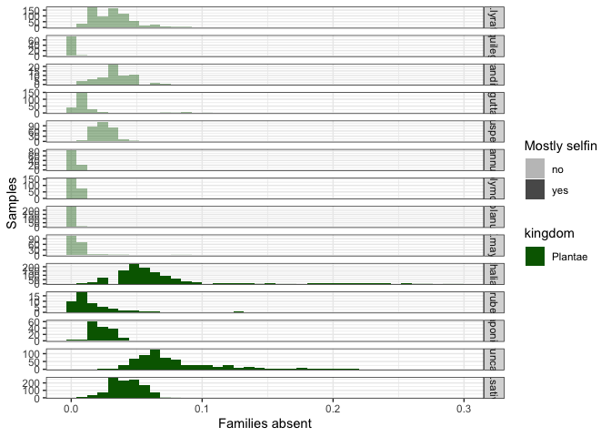
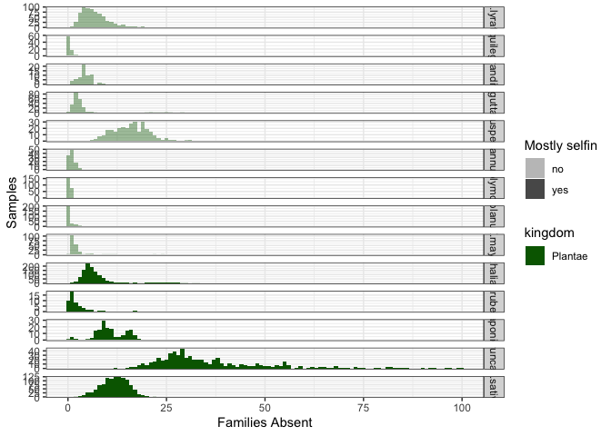
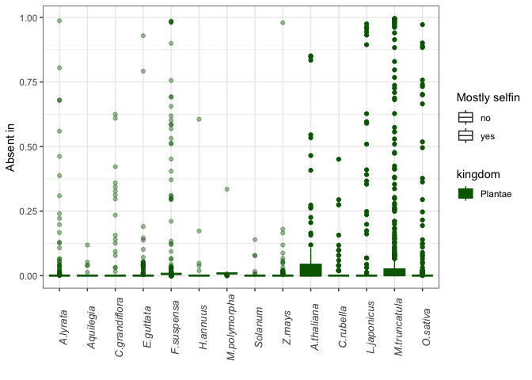
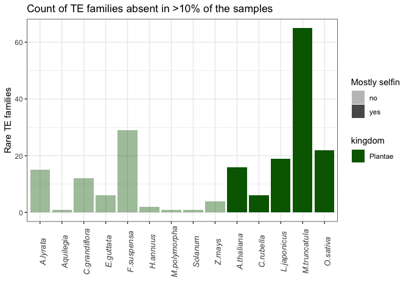
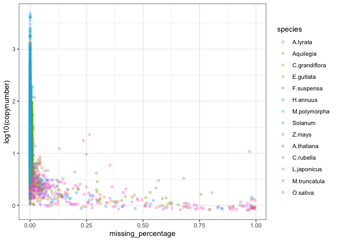

TE patchyness
================

``` r
suppressPackageStartupMessages(library(tidyverse))
suppressPackageStartupMessages(library(knitr))
suppressPackageStartupMessages(library(kableExtra))
suppressPackageStartupMessages(library(ggpubr))
suppressPackageStartupMessages(library(svglite))
theme_set(theme_bw())
```

## File import

    Rscript outputfolder2file.R --folder ../data-patchyness/D.suzukii --file ../data-patchyness/D.suzukii.raw.tsv

    echo -e "species\tsample\ttype\tname\tlen\traw\tcopynumber" > combined_raw.tsv && for file in *.raw.tsv; do species=$(basename "$file" .raw.tsv); awk -v species="$species" 'NR>1 {print species "\t" $0}' "$file"; done >> combined_raw.tsv

Read metadata and copynumber estimates

``` r
species_metadata <- read_tsv("/Volumes/Storage/ara-droso/metadata/species-metadata2.txt")
```

    ## Rows: 25 Columns: 14
    ## ── Column specification ────────────────────────────────────────────────────────
    ## Delimiter: "\t"
    ## chr (11): genus, spec, species, kingdom, phylum, group, silencing_spread, se...
    ## dbl  (1): n_data
    ## lgl  (2): recent_selfin_history, status
    ## 
    ## ℹ Use `spec()` to retrieve the full column specification for this data.
    ## ℹ Specify the column types or set `show_col_types = FALSE` to quiet this message.

``` r
dmel_metadata <- read_tsv("/Volumes/Storage/mining/GenomeDelta2.0/utilities/dmel-metadata.tsv")
```

    ## Rows: 879 Columns: 9
    ## ── Column specification ────────────────────────────────────────────────────────
    ## Delimiter: "\t"
    ## chr (6): sample, strain, publication, study, study_id, location
    ## dbl (3): year, lat, lon
    ## 
    ## ℹ Use `spec()` to retrieve the full column specification for this data.
    ## ℹ Specify the column types or set `show_col_types = FALSE` to quiet this message.

``` r
(data <- read_tsv("/Volumes/Storage/ara-droso/data-patchyness/selected/combined_raw.tsv") %>% inner_join(species_metadata, by="species") %>% mutate(sample = str_extract(sample, "[^/]+$")) %>% mutate(sample = gsub(".fastq.sort.deviate", "", sample)) %>% left_join(dmel_metadata, by="sample"))
```

    ## Rows: 6546046 Columns: 7
    ## ── Column specification ────────────────────────────────────────────────────────
    ## Delimiter: "\t"
    ## chr (4): species, sample, type, name
    ## dbl (3): len, raw, copynumber
    ## 
    ## ℹ Use `spec()` to retrieve the full column specification for this data.
    ## ℹ Specify the column types or set `show_col_types = FALSE` to quiet this message.

    ## # A tibble: 6,546,046 × 28
    ##    species sample type  name    len    raw copynumber genus spec  kingdom phylum
    ##    <chr>   <chr>  <chr> <chr> <dbl>  <dbl>      <dbl> <chr> <chr> <chr>   <chr> 
    ##  1 A.colu… ERR16… scg   Dus4   7521  502.       1.39  Anop… colu… Animal… Arthr…
    ##  2 A.colu… ERR16… scg   RnrL   3435  125.       0.758 Anop… colu… Animal… Arthr…
    ##  3 A.colu… ERR16… scg   veli   1685   68.5      0.848 Anop… colu… Animal… Arthr…
    ##  4 A.colu… ERR16… te    rnd-… 11219 9171.      17.1   Anop… colu… Animal… Arthr…
    ##  5 A.colu… ERR16… te    rnd-… 15260 7600.      10.4   Anop… colu… Animal… Arthr…
    ##  6 A.colu… ERR16… te    rnd-…  7459 3813.      10.7   Anop… colu… Animal… Arthr…
    ##  7 A.colu… ERR16… te    rnd-…  7021 5407.      16.1   Anop… colu… Animal… Arthr…
    ##  8 A.colu… ERR16… te    rnd-…  1100 1396.      26.5   Anop… colu… Animal… Arthr…
    ##  9 A.colu… ERR16… te    rnd-…  4703 5034.      22.3   Anop… colu… Animal… Arthr…
    ## 10 A.colu… ERR16… te    rnd-…  5158  833.       3.37  Anop… colu… Animal… Arthr…
    ## # ℹ 6,546,036 more rows
    ## # ℹ 17 more variables: group <chr>, silencing_spread <chr>,
    ## #   recent_selfin_history <lgl>, selfin_rate <chr>, absent_tes <chr>,
    ## #   n_data <dbl>, `data_source(s)` <chr>, status <lgl>, miner <chr>,
    ## #   strain <chr>, publication <chr>, study <chr>, study_id <chr>, year <dbl>,
    ## #   location <chr>, lat <dbl>, lon <dbl>

``` r
data %>% select(species) %>% distinct()
```

    ## # A tibble: 21 × 1
    ##    species       
    ##    <chr>         
    ##  1 A.coluzzii    
    ##  2 A.lyrata      
    ##  3 A.thaliana    
    ##  4 Aquilegia     
    ##  5 C.elegans     
    ##  6 C.grandiflora 
    ##  7 C.rubella     
    ##  8 D.melanogaster
    ##  9 D.sechellia   
    ## 10 E.guttata     
    ## # ℹ 11 more rows

``` r
# Filtering our short TEs, unclassified TEs and other repeats. Defining "presence" and "absence" based on copynumber threshold of 0.7
te_data <- data %>%
  filter(
    type == "te",
    !str_detect(name, "Satellite|Simple_repeat|tRNA|Unknown|rRNA"),
    is.na(study_id) | study_id %in% c("Chen2024", "Kapun2021"),
    case_when(
      TRUE ~ len > 500
    )
  ) %>%
  mutate(presence = ifelse(copynumber > 0.7, "present", "absent"))

# Identify TEs present in at least 1 sample
tes_present_min1sample <- te_data %>% filter(presence == "present") %>% group_by(species, name) %>% summarise(n_samples = n()) %>% filter(n_samples>2) %>% distinct()
```

    ## `summarise()` has grouped output by 'species'. You can override using the
    ## `.groups` argument.

``` r
# Filtering out low coverage samples and TEs missing from every sample
te_present <- te_data %>% inner_join(tes_present_min1sample, by=c("species","name"))

# Filtering out TEs present in copynumber around the threshold (false patchy)
patchy_tes <- te_present %>% filter(presence=="absent") %>% select(name, species) %>% distinct()
copy_patchy_tes <- te_present %>% inner_join(patchy_tes, by=c("name","species")) %>% group_by(species, name) %>% summarise(min = min(copynumber), max=max(copynumber), maxdiff = max-min) %>% arrange(desc(min))
```

    ## `summarise()` has grouped output by 'species'. You can override using the
    ## `.groups` argument.

``` r
false_patchy <- copy_patchy_tes %>% filter(maxdiff<1)
te_present <- te_present %>% filter(!(name %in% false_patchy$name))

write_tsv(te_present, "/Volumes/Storage/ara-droso/data-other/te-all-data.tsv")
```

``` r
te_present <- read_tsv("/Volumes/Storage/ara-droso/data-other/te-all-data.tsv")
```

    ## Rows: 1788246 Columns: 30
    ## ── Column specification ────────────────────────────────────────────────────────
    ## Delimiter: "\t"
    ## chr (20): species, sample, type, name, genus, spec, kingdom, phylum, group, ...
    ## dbl  (8): len, raw, copynumber, n_data, year, lat, lon, n_samples
    ## lgl  (2): recent_selfin_history, status
    ## 
    ## ℹ Use `spec()` to retrieve the full column specification for this data.
    ## ℹ Specify the column types or set `show_col_types = FALSE` to quiet this message.

``` r
selfin_info <- read_tsv("/Volumes/Storage/ara-droso/metadata/species-selfin-info.txt")
```

    ## Rows: 23 Columns: 2
    ## ── Column specification ────────────────────────────────────────────────────────
    ## Delimiter: "\t"
    ## chr (2): species, selfin
    ## 
    ## ℹ Use `spec()` to retrieve the full column specification for this data.
    ## ℹ Specify the column types or set `show_col_types = FALSE` to quiet this message.

``` r
#Summarise
summarised <- te_present %>% group_by(species, recent_selfin_history, selfin_rate) %>% mutate(total_families = n_distinct(name)) %>% group_by(species, sample, study_id, total_families, kingdom, recent_selfin_history, selfin_rate) %>% summarise(present = sum(presence == "present"), absent = sum(presence == "absent")) %>% mutate(present_percentage = present/total_families) %>% inner_join(selfin_info, by = "species") %>% filter(kingdom == "Plantae")
```

    ## `summarise()` has grouped output by 'species', 'sample', 'study_id',
    ## 'total_families', 'kingdom', 'recent_selfin_history'. You can override using
    ## the `.groups` argument.

``` r
order_species <- summarised %>% ungroup() %>% arrange(kingdom, selfin, species) %>% select(species) %>% distinct() %>% pull()

te_present_filtered <- summarised %>% 
  mutate(species = factor(species, levels = order_species), missing_tes = 1-present_percentage) %>% arrange(present_percentage) %>% filter(missing_tes < 0.3)

(dist <- ggplot(te_present_filtered, aes(x = missing_tes, fill = kingdom, alpha = selfin)) + 
  geom_histogram(binwidth = 0.008) +
  #scale_fill_manual(values = c("orange","darkgreen")) +
  scale_fill_manual(values = c("darkgreen")) +
  scale_alpha_manual(values = c(0.4, 1)) +
  facet_grid(species ~ ., scales = "free_y") + 
  labs(y = "Samples", x = "Families absent", alpha = "Mostly selfin"))
```

<!-- -->

``` r
(dist_absolute <- ggplot(te_present_filtered, aes(x = absent, fill = kingdom, alpha = selfin)) + 
  geom_histogram(binwidth = 1) +
  #scale_fill_manual(values = c("orange","darkgreen")) +
  scale_fill_manual(values = c("darkgreen")) +
  scale_alpha_manual(values = c(0.4, 1)) +
  facet_grid(species ~ ., scales = "free_y") + 
  labs(y = "Samples", x = "Families Absent", alpha = "Mostly selfin"))
```

<!-- -->

``` r
terarity <- te_present %>% inner_join(selfin_info, by = "species") %>% filter(kingdom == "Plantae") %>% group_by(name, species) %>% mutate(total_samples = n_distinct(sample)) %>% group_by(species, name, total_samples, kingdom, selfin) %>% summarise(present = sum(presence == "present"), absent = sum(presence == "absent"), copynumber = mean(copynumber[presence == "present"], na.rm = TRUE)) %>% mutate(present_percentage = present/total_samples, missing_percentage = 1- present_percentage) %>% arrange(desc(missing_percentage)) %>% mutate(species = factor(species, levels = order_species))
```

    ## `summarise()` has grouped output by 'species', 'name', 'total_samples',
    ## 'kingdom'. You can override using the `.groups` argument.

``` r
(box_rarities <- ggplot(terarity, aes(y = 1-present_percentage, x = species, fill = kingdom, color = kingdom, alpha = selfin)) + 
  geom_boxplot() +
  #scale_fill_manual(values = c("orange","darkgreen")) +
  #scale_color_manual(values = c("orange","darkgreen")) +
  scale_fill_manual(values = c("darkgreen")) +
  scale_color_manual(values = c("darkgreen")) +
  scale_alpha_manual(values = c(0.4, 1)) +
  labs(y = "Absent in", x = "", alpha = "Mostly selfin") + 
  theme(axis.text.x = element_text(size = 10, face = "italic", angle = 90),
        legend.position = "right"))
```

<!-- -->

``` r
terarity_filtered <- terarity %>% group_by(species, kingdom, selfin) %>% summarise(rare_count = sum(missing_percentage > 0.1))
```

    ## `summarise()` has grouped output by 'species', 'kingdom'. You can override
    ## using the `.groups` argument.

``` r
(te_count <- terarity %>% group_by(species, kingdom, selfin) %>% summarise(te_families = n()) %>% inner_join(terarity_filtered, by = c("species", "kingdom")))
```

    ## `summarise()` has grouped output by 'species', 'kingdom'. You can override
    ## using the `.groups` argument.

    ## # A tibble: 14 × 6
    ## # Groups:   species, kingdom [14]
    ##    species       kingdom selfin.x te_families selfin.y rare_count
    ##    <fct>         <chr>   <chr>          <int> <chr>         <int>
    ##  1 A.lyrata      Plantae no               213 no               15
    ##  2 Aquilegia     Plantae no               305 no                1
    ##  3 C.grandiflora Plantae no               123 no               12
    ##  4 E.guttata     Plantae no               283 no                6
    ##  5 F.suspensa    Plantae no               658 no               29
    ##  6 H.annuus      Plantae no               484 no                2
    ##  7 M.polymorpha  Plantae no                98 no                1
    ##  8 Solanum       Plantae no               521 no                1
    ##  9 Z.mays        Plantae no               282 no                4
    ## 10 A.thaliana    Plantae yes              111 yes              16
    ## 11 C.rubella     Plantae yes              134 yes               6
    ## 12 L.japonicus   Plantae yes              465 yes              19
    ## 13 M.truncatula  Plantae yes              465 yes              65
    ## 14 O.sativa      Plantae yes              281 yes              22

``` r
(hist_rarities <- ggplot(terarity_filtered, aes(x = species, y = rare_count, fill = kingdom, alpha = selfin)) + 
  geom_bar(stat = "identity") +
  #scale_fill_manual(values = c("orange","darkgreen")) +
  scale_fill_manual(values = c("darkgreen")) +
  scale_color_manual(values = c("darkgreen")) +
  scale_alpha_manual(values = c(0.4, 1)) +
  labs(y = "Rare TE families", x = "", title = "Count of TE families absent in >10% of the samples", alpha = "Mostly selfin") +
  theme(axis.text.x = element_text(size = 10, face = "italic", angle = 90),
        legend.position = "right"))
```

<!-- -->

Rarity and copynumber

``` r
ggplot(terarity, aes(x = missing_percentage, y = log10(copynumber)))+
  geom_point(alpha = 0.3, aes(color = species))
```

<!-- -->

## Export pictures

``` r
ggsave("/Volumes/Storage/ara-droso/figures/absent-tes.png", dist, dpi = 600, height = 15)
```

    ## Saving 7 x 15 in image

``` r
ggsave("/Volumes/Storage/ara-droso/figures/absent-tes-absolute.png", dist_absolute, dpi = 600, height = 15)
```

    ## Saving 7 x 15 in image

``` r
ggsave("/Volumes/Storage/ara-droso/figures/te-rarity.png", box_rarities, dpi = 600)
```

    ## Saving 7 x 5 in image

``` r
ggsave("/Volumes/Storage/ara-droso/figures/rare-tes-count.png", hist_rarities, dpi = 600)
```

    ## Saving 7 x 5 in image
