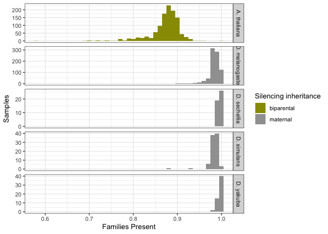
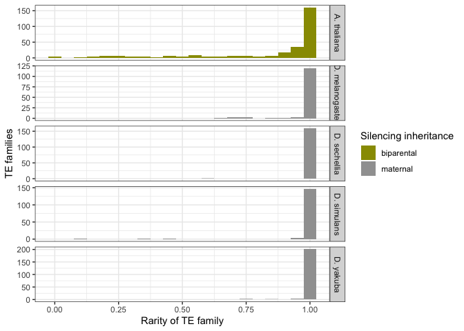

TE patchyness
================

``` r
suppressPackageStartupMessages(library(tidyverse))
suppressPackageStartupMessages(library(knitr))
suppressPackageStartupMessages(library(kableExtra))
suppressPackageStartupMessages(library(ggpubr))
suppressPackageStartupMessages(library(svglite))
theme_set(theme_bw())
```

## File import

Read metadata and copynumber estimates

``` r
athaliana <- read_tsv("/Volumes/Storage/ara-droso/data-patchyness/A.thaliana.tsv") %>% mutate(species = "A. thaliana", silencing_spread="biparental") %>% mutate(families_present = load/284)
```

    ## Rows: 1135 Columns: 4
    ## ── Column specification ────────────────────────────────────────────────────────
    ## Delimiter: "\t"
    ## chr (1): ID
    ## dbl (3): load, Lat, Long
    ## 
    ## ℹ Use `spec()` to retrieve the full column specification for this data.
    ## ℹ Specify the column types or set `show_col_types = FALSE` to quiet this message.

``` r
dmelanogaster <- read_tsv("/Volumes/Storage/ara-droso/data-patchyness/D.melanogaster.tsv") %>% mutate(species = "D. melanogaster", silencing_spread="maternal")
```

    ## Rows: 815 Columns: 5
    ## ── Column specification ────────────────────────────────────────────────────────
    ## Delimiter: "\t"
    ## chr (1): ID
    ## dbl (4): load, families_present, Lat, Long
    ## 
    ## ℹ Use `spec()` to retrieve the full column specification for this data.
    ## ℹ Specify the column types or set `show_col_types = FALSE` to quiet this message.

``` r
dsimulans <- read_tsv("/Volumes/Storage/ara-droso/data-patchyness/D.simulans.tsv") %>% mutate(species = "D. simulans", silencing_spread="maternal")
```

    ## Rows: 89 Columns: 3
    ## ── Column specification ────────────────────────────────────────────────────────
    ## Delimiter: "\t"
    ## chr (1): ID
    ## dbl (2): load, families_present
    ## 
    ## ℹ Use `spec()` to retrieve the full column specification for this data.
    ## ℹ Specify the column types or set `show_col_types = FALSE` to quiet this message.

``` r
dsechellia <- read_tsv("/Volumes/Storage/ara-droso/data-patchyness/D.sechellia.tsv") %>% mutate(species = "D. sechellia", silencing_spread="maternal")
```

    ## Rows: 45 Columns: 3
    ## ── Column specification ────────────────────────────────────────────────────────
    ## Delimiter: "\t"
    ## chr (1): ID
    ## dbl (2): load, families_present
    ## 
    ## ℹ Use `spec()` to retrieve the full column specification for this data.
    ## ℹ Specify the column types or set `show_col_types = FALSE` to quiet this message.

``` r
dyakuba <- read_tsv("/Volumes/Storage/ara-droso/data-patchyness/D.yakuba.tsv") %>% mutate(species = "D. yakuba", silencing_spread="maternal")
```

    ## Rows: 57 Columns: 3
    ## ── Column specification ────────────────────────────────────────────────────────
    ## Delimiter: "\t"
    ## chr (1): ID
    ## dbl (2): load, families_present
    ## 
    ## ℹ Use `spec()` to retrieve the full column specification for this data.
    ## ℹ Specify the column types or set `show_col_types = FALSE` to quiet this message.

``` r
(data <- bind_rows(athaliana, dmelanogaster, dsimulans, dsechellia, dyakuba) %>% arrange(families_present))
```

    ## # A tibble: 2,141 × 7
    ##    ID          load   Lat  Long species     silencing_spread families_present
    ##    <chr>      <dbl> <dbl> <dbl> <chr>       <chr>                       <dbl>
    ##  1 SRR1946510   164  46.4 11.2  A. thaliana biparental                  0.577
    ##  2 SRR1945967   196  57.7 15.8  A. thaliana biparental                  0.690
    ##  3 SRR1946545   199  39.0 48.6  A. thaliana biparental                  0.701
    ##  4 SRR1946513   200  46.4 11.3  A. thaliana biparental                  0.704
    ##  5 SRR1946487   203  36.8 -6.36 A. thaliana biparental                  0.715
    ##  6 SRR1945761   204  63.0 18.3  A. thaliana biparental                  0.718
    ##  7 SRR1946515   204  46.3 11.3  A. thaliana biparental                  0.718
    ##  8 SRR1946506   207  38.4 16.2  A. thaliana biparental                  0.729
    ##  9 SRR1946517   209  46.6 10.8  A. thaliana biparental                  0.736
    ## 10 SRR1945789   210  60   23.5  A. thaliana biparental                  0.739
    ## # ℹ 2,131 more rows

``` r
(dist <- ggplot(data, aes(x = families_present, fill=silencing_spread)) + 
  geom_histogram(binwidth = 0.01) +
  scale_fill_manual(values = c("#999900","#A0A0A0")) +
  facet_grid(species ~ ., scales = "free_y") + 
  labs(y = "Samples", x = "Families Present", fill = "Silencing inheritance")+
  theme(legend.position = "right"))
```

<!-- -->

``` r
athaliana_te <- read_tsv("/Volumes/Storage/ara-droso/data-patchyness/A.thaliana.TEs.tsv") %>% mutate(species = "A. thaliana", silencing_spread="biparental", rarity = present_in/1135)
```

    ## Rows: 296 Columns: 3
    ## ── Column specification ────────────────────────────────────────────────────────
    ## Delimiter: "\t"
    ## chr (2): te, distbin
    ## dbl (1): present_in
    ## 
    ## ℹ Use `spec()` to retrieve the full column specification for this data.
    ## ℹ Specify the column types or set `show_col_types = FALSE` to quiet this message.

``` r
dmelanogaster_te <- read_tsv("/Volumes/Storage/ara-droso/data-patchyness/D.melanogaster.TEs.tsv") %>% mutate(species = "D. melanogaster", silencing_spread="maternal")
```

    ## Rows: 129 Columns: 4
    ## ── Column specification ────────────────────────────────────────────────────────
    ## Delimiter: "\t"
    ## chr (1): name
    ## dbl (3): present, absent, rarity
    ## 
    ## ℹ Use `spec()` to retrieve the full column specification for this data.
    ## ℹ Specify the column types or set `show_col_types = FALSE` to quiet this message.

``` r
dsimulans_te <- read_tsv("/Volumes/Storage/ara-droso/data-patchyness/D.simulans.TEs.tsv") %>% mutate(species = "D. simulans", silencing_spread="maternal")
```

    ## Rows: 154 Columns: 4
    ## ── Column specification ────────────────────────────────────────────────────────
    ## Delimiter: "\t"
    ## chr (1): name
    ## dbl (3): present, absent, rarity
    ## 
    ## ℹ Use `spec()` to retrieve the full column specification for this data.
    ## ℹ Specify the column types or set `show_col_types = FALSE` to quiet this message.

``` r
dsechellia_te <- read_tsv("/Volumes/Storage/ara-droso/data-patchyness/D.sechellia.TEs.tsv") %>% mutate(species = "D. sechellia", silencing_spread="maternal")
```

    ## Rows: 160 Columns: 4
    ## ── Column specification ────────────────────────────────────────────────────────
    ## Delimiter: "\t"
    ## chr (1): name
    ## dbl (3): present, absent, rarity
    ## 
    ## ℹ Use `spec()` to retrieve the full column specification for this data.
    ## ℹ Specify the column types or set `show_col_types = FALSE` to quiet this message.

``` r
dyakuba_te <- read_tsv("/Volumes/Storage/ara-droso/data-patchyness/D.yakuba.TEs.tsv") %>% mutate(species = "D. yakuba", silencing_spread="maternal")
```

    ## Rows: 207 Columns: 4
    ## ── Column specification ────────────────────────────────────────────────────────
    ## Delimiter: "\t"
    ## chr (1): name
    ## dbl (3): present, absent, rarity
    ## 
    ## ℹ Use `spec()` to retrieve the full column specification for this data.
    ## ℹ Specify the column types or set `show_col_types = FALSE` to quiet this message.

``` r
(data_te <- bind_rows(athaliana_te, dmelanogaster_te, dsimulans_te, dsechellia_te, dyakuba_te))
```

    ## # A tibble: 946 × 9
    ##    te    present_in distbin species silencing_spread rarity name  present absent
    ##    <chr>      <dbl> <chr>   <chr>   <chr>             <dbl> <chr>   <dbl>  <dbl>
    ##  1 ARNO…       1132 91-99%  A. tha… biparental        0.997 <NA>       NA     NA
    ##  2 ATCO…        811 71-80%  A. tha… biparental        0.715 <NA>       NA     NA
    ##  3 VAND…       1123 91-99%  A. tha… biparental        0.989 <NA>       NA     NA
    ##  4 ATCO…        276 21-30%  A. tha… biparental        0.243 <NA>       NA     NA
    ##  5 ATRE1        524 41-50%  A. tha… biparental        0.462 <NA>       NA     NA
    ##  6 ATEN…       1125 91-99%  A. tha… biparental        0.991 <NA>       NA     NA
    ##  7 HELI…       1096 91-99%  A. tha… biparental        0.966 <NA>       NA     NA
    ##  8 ATCO…        605 51-60%  A. tha… biparental        0.533 <NA>       NA     NA
    ##  9 ATHI…       1135 100%    A. tha… biparental        1     <NA>       NA     NA
    ## 10 ATCO…       1061 91-99%  A. tha… biparental        0.935 <NA>       NA     NA
    ## # ℹ 936 more rows

``` r
(dist_te <- ggplot(data_te, aes(x = rarity, fill=silencing_spread)) + 
  geom_histogram(binwidth = 0.05) +
  scale_fill_manual(values = c("#999900","#A0A0A0")) +
  facet_grid(species ~ ., scales = "free_y") + 
  labs(y = "TE families", x = "Rarity of TE family", fill = "Silencing inheritance")+
  theme(legend.position = "right"))
```

<!-- -->

    for i in /mnt/data2/riccardo/dmel-longreads-assemblies/*.fa; do ~/repeatannotation/RepeatMasker/RepeatMasker -pa 30 -no_is -s -nolow -dir RM-out/ -lib ref/dmel-TEs-update.fasta "$i"; done

``` r
athal_LR <- read_tsv("/Volumes/Storage/ara-droso/data-longreads/AthalRM.tsv") %>% mutate(s = "A. thaliana", silencing_spread="biparental")
```

    ## Rows: 6512 Columns: 4
    ## ── Column specification ────────────────────────────────────────────────────────
    ## Delimiter: "\t"
    ## chr (1): te
    ## dbl (3): Species, maxScore, present_in
    ## 
    ## ℹ Use `spec()` to retrieve the full column specification for this data.
    ## ℹ Specify the column types or set `show_col_types = FALSE` to quiet this message.

``` r
n_tes <- athal_LR %>% select(te) %>% distinct

athal_sample <- athal_LR %>% group_by(s, Species, silencing_spread) %>% summarise(load = n()) %>% mutate(families_present = load/292, Species = as.character(Species))
```

    ## `summarise()` has grouped output by 's', 'Species'. You can override using the
    ## `.groups` argument.

``` r
athal_TE <- athal_LR %>% select(s, te, present_in, silencing_spread) %>% distinct() %>% mutate(rarity = present_in/27)

dmel_LR <- read_tsv("/Volumes/Storage/ara-droso/data-longreads/DmelRM.tsv") %>% mutate(s = "D. melanogaster", silencing_spread="maternal")
```

    ## Rows: 6112 Columns: 3
    ## ── Column specification ────────────────────────────────────────────────────────
    ## Delimiter: "\t"
    ## chr (2): Species, te
    ## dbl (1): present_in
    ## 
    ## ℹ Use `spec()` to retrieve the full column specification for this data.
    ## ℹ Specify the column types or set `show_col_types = FALSE` to quiet this message.

``` r
n_tes <- dmel_LR %>% select(te) %>% distinct

(dmel_sample <- dmel_LR %>% group_by(s, Species, silencing_spread) %>% summarise(load = n()) %>% mutate(families_present = load/125))
```

    ## `summarise()` has grouped output by 's', 'Species'. You can override using the
    ## `.groups` argument.

    ## # A tibble: 49 × 5
    ## # Groups:   s, Species [49]
    ##    s               Species         silencing_spread  load families_present
    ##    <chr>           <chr>           <chr>            <int>            <dbl>
    ##  1 D. melanogaster D.mel.A2.fa     maternal           124            0.992
    ##  2 D. melanogaster D.mel.A3.fa     maternal           124            0.992
    ##  3 D. melanogaster D.mel.A4.fa     maternal           124            0.992
    ##  4 D. melanogaster D.mel.A5.fa     maternal           124            0.992
    ##  5 D. melanogaster D.mel.A6.fa     maternal           124            0.992
    ##  6 D. melanogaster D.mel.A7.fa     maternal           124            0.992
    ##  7 D. melanogaster D.mel.AB8.fa    maternal           125            1    
    ##  8 D. melanogaster D.mel.AKA017.fa maternal           125            1    
    ##  9 D. melanogaster D.mel.AKA018.fa maternal           125            1    
    ## 10 D. melanogaster D.mel.B1.fa     maternal           124            0.992
    ## # ℹ 39 more rows

``` r
(dmel_TE <- dmel_LR %>% select(s, te, present_in, silencing_spread) %>% distinct() %>% mutate(rarity = present_in/49))
```

    ## # A tibble: 125 × 5
    ##    s               te         present_in silencing_spread rarity
    ##    <chr>           <chr>           <dbl> <chr>             <dbl>
    ##  1 D. melanogaster DMTNFB             49 maternal          1    
    ##  2 D. melanogaster 1360               49 maternal          1    
    ##  3 D. melanogaster 412                49 maternal          1    
    ##  4 D. melanogaster DMMDG3             49 maternal          1    
    ##  5 D. melanogaster FB                 13 maternal          0.265
    ##  6 D. melanogaster DMTRDNA            49 maternal          1    
    ##  7 D. melanogaster STALKER3           49 maternal          1    
    ##  8 D. melanogaster McCLINTOCK         49 maternal          1    
    ##  9 D. melanogaster INVADER5           48 maternal          0.980
    ## 10 D. melanogaster TRANSIB3           49 maternal          1    
    ## # ℹ 115 more rows

``` r
lr_data_sample <- bind_rows(athal_sample, dmel_sample)
lr_data_te <- bind_rows(athal_TE, dmel_TE)


(dist_LR <- ggplot(lr_data_sample, aes(x = families_present, fill=silencing_spread)) + 
  geom_histogram(binwidth = 0.01) +
  scale_fill_manual(values = c("#999900","#A0A0A0")) +
  facet_grid(s ~ ., scales = "free_y") + 
  labs(y = "Samples", x = "Families Present", fill = "Silencing inheritance", title = "Based on long-reads assemblies")+
  theme(legend.position = "right")+
  coord_cartesian(xlim = c(0,1)))
```

<!-- -->

``` r
(dist_te_LR <- ggplot(lr_data_te, aes(x = rarity, fill=silencing_spread)) + 
  geom_histogram(binwidth = 0.05) +
  scale_fill_manual(values = c("#999900","#A0A0A0")) +
  facet_grid(s ~ ., scales = "free_y") + 
  labs(y = "TE families", x = "Rarity of TE family", fill = "Silencing inheritance", title = "Based on long-reads assemblies")+
  theme(legend.position = "right"))
```

<!-- -->

## Export pictures

``` r
ggsave("/Volumes/Storage/ara-droso/figures/family_load_distribution.png", dist, dpi = 600)
```

    ## Saving 7 x 5 in image

``` r
ggsave("/Volumes/Storage/ara-droso/figures/rarity_distribution.png", dist_te, dpi = 600)
```

    ## Saving 7 x 5 in image

``` r
ggsave("/Volumes/Storage/ara-droso/figures/LR_family_load_distribution.png", dist_LR, dpi = 600)
```

    ## Saving 7 x 5 in image

``` r
ggsave("/Volumes/Storage/ara-droso/figures/LR_rarity_distribution.png", dist_te_LR, dpi = 600)
```

    ## Saving 7 x 5 in image
