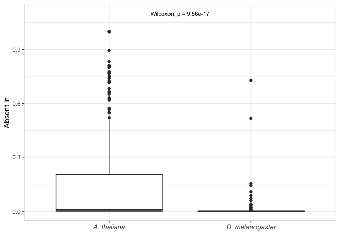
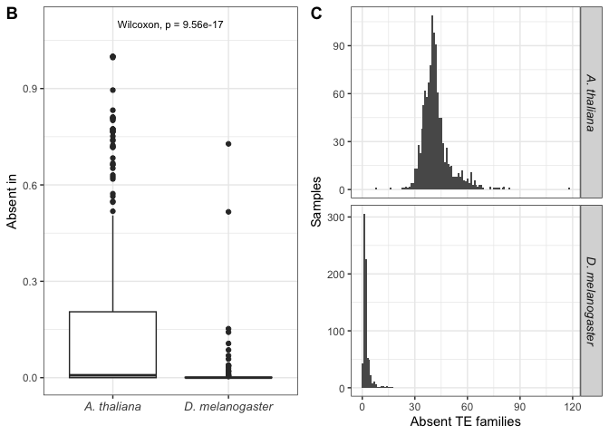
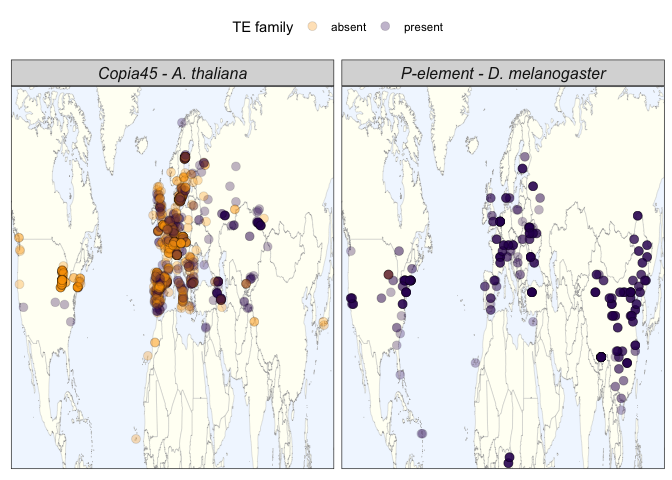
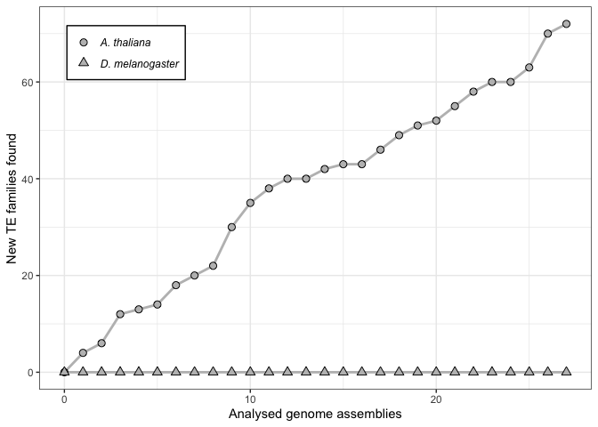
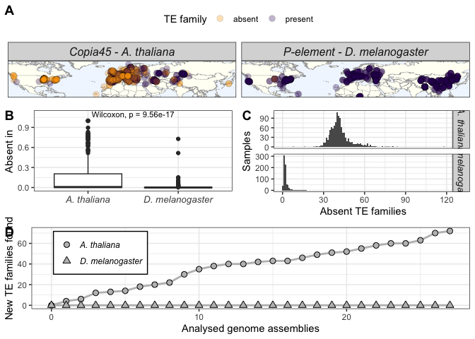

Figure 1: D.melanogaster vs A.thaliana
================

``` r
suppressPackageStartupMessages(library(tidyverse))
suppressPackageStartupMessages(library(knitr))
suppressPackageStartupMessages(library(kableExtra))
suppressPackageStartupMessages(library(ggpubr))
suppressPackageStartupMessages(library(svglite))
theme_set(theme_bw())
```

## File import

``` r
dmel_metadata <- read_tsv("/Volumes/Storage/mining/GenomeDelta2.0/utilities/dmel-metadata.tsv") %>% filter(year>1970) %>% select(sample, lat, lon, location, study_id)
```

    ## Rows: 879 Columns: 9
    ## ── Column specification ────────────────────────────────────────────────────────
    ## Delimiter: "\t"
    ## chr (6): sample, strain, publication, study, study_id, location
    ## dbl (3): year, lat, lon
    ## 
    ## ℹ Use `spec()` to retrieve the full column specification for this data.
    ## ℹ Specify the column types or set `show_col_types = FALSE` to quiet this message.

``` r
list_dmel_tes <- read_tsv("/Volumes/Storage/ara-droso/metadata/dmel-te-metadata.tsv")
```

    ## Rows: 129 Columns: 6
    ## ── Column specification ────────────────────────────────────────────────────────
    ## Delimiter: "\t"
    ## chr (5): te, te_name, te_type, te_subtype, class
    ## dbl (1): len
    ## 
    ## ℹ Use `spec()` to retrieve the full column specification for this data.
    ## ℹ Specify the column types or set `show_col_types = FALSE` to quiet this message.

``` r
athaliana_metadata <- read_tsv("/Volumes/Storage/ara-droso/metadata/A.thaliana-shortreads-metadata.tsv") %>% rename("sample"=ID, "lat"=Lat, "lon"=Long, "location"=Geo_group) %>% select(sample, lat, lon, AdMixGroup, location)
```

    ## Rows: 1135 Columns: 15
    ## ── Column specification ────────────────────────────────────────────────────────
    ## Delimiter: "\t"
    ## chr (12): Sequencer, NameID, CountryID, Name, Collector, Date, CSNumber, AdM...
    ## dbl  (3): AccessionID, Lat, Long
    ## 
    ## ℹ Use `spec()` to retrieve the full column specification for this data.
    ## ℹ Specify the column types or set `show_col_types = FALSE` to quiet this message.

``` r
complete_metadata <- bind_rows(dmel_metadata, athaliana_metadata)

dmelanogaster <- read_tsv("/Volumes/Storage/ara-droso/data-dmel-athal/D.melanogaster.raw.tsv") %>% mutate(sample = gsub("\\./|\\.fastq\\.sort\\.tsv", "", sample)) %>% inner_join(dmel_metadata, by="sample") %>% filter(!(study_id %in% c("Lange2021","Shpak2023")), type=="te") %>% select(sample, name, copynumber) %>% filter(name %in% list_dmel_tes$te) %>% mutate(species="D. melanogaster")
```

    ## Rows: 223660 Columns: 6
    ## ── Column specification ────────────────────────────────────────────────────────
    ## Delimiter: "\t"
    ## chr (3): sample, type, name
    ## dbl (3): len, raw, copynumber
    ## 
    ## ℹ Use `spec()` to retrieve the full column specification for this data.
    ## ℹ Specify the column types or set `show_col_types = FALSE` to quiet this message.

``` r
athaliana <- read_tsv("/Volumes/Storage/ara-droso/data-dmel-athal/Athalraw_df.tsv") %>% rename(sample = ID, name = te, copynumber = sum_norm_count) %>% mutate(species="A. thaliana")
```

    ## Rows: 335960 Columns: 3
    ## ── Column specification ────────────────────────────────────────────────────────
    ## Delimiter: "\t"
    ## chr (2): te, ID
    ## dbl (1): sum_norm_count
    ## 
    ## ℹ Use `spec()` to retrieve the full column specification for this data.
    ## ℹ Specify the column types or set `show_col_types = FALSE` to quiet this message.

``` r
dmel_athal <- bind_rows(dmelanogaster, athaliana) %>% inner_join(complete_metadata, by="sample")
```

``` r
tes <- dmel_athal %>% mutate(presence = ifelse(copynumber>0.7, "present", "absent")) %>% group_by(species, name) %>% mutate(te_absent_in = sum(presence=="absent"), te_present_in = sum(presence=="present"))

patchy_tes <- tes %>% filter(presence=="absent") %>% select(name, species) %>% distinct()
copy_patchy_tes <- tes %>% inner_join(patchy_tes, by=c("name","species")) %>% group_by(name, species) %>% summarise(min = min(copynumber), max=max(copynumber), maxdiff = max-min) %>% arrange(desc(min))
```

    ## `summarise()` has grouped output by 'name'. You can override using the
    ## `.groups` argument.

``` r
false_patchy <- copy_patchy_tes %>% filter(maxdiff<1)

# Filtering out TEs present in very low copy number everywhere
tes_clean <- tes %>% filter(!(name %in% false_patchy$name)) #%>% filter(name!="HELITRON1_DM"))

summarised <- tes_clean %>% group_by(sample, species) %>% mutate(total_families = n_distinct(name)) %>% group_by(species, sample, total_families) %>% summarise(present = sum(copynumber>0.7), absent = sum(copynumber<=0.7))# %>% mutate(present_percentage = present/total_families, missing_percentage = 1- present_percentage))
```

    ## `summarise()` has grouped output by 'species', 'sample'. You can override using
    ## the `.groups` argument.

``` r
dist <- ggplot(summarised, aes(x = absent)) + 
  geom_histogram(binwidth = 1) +
  #scale_fill_manual(values = c("darkgreen","#9e817b")) +
  facet_grid(species ~ ., scales = "free_y") + 
  labs(y = "Samples", x = "Absent TE families") +
  theme(strip.text = element_text(size = 10, face = "italic"),
        legend.position = "none")

terarity <- tes %>% group_by(name, species) %>% mutate(total_samples = n_distinct(sample)) %>% group_by(species, name, total_samples) %>% summarise(present = sum(presence == "present"), absent = sum(presence == "absent")) %>% mutate(present_percentage = present/total_samples, missing_percentage = 1- present_percentage) %>% arrange(desc(missing_percentage))
```

    ## `summarise()` has grouped output by 'species', 'name'. You can override using
    ## the `.groups` argument.

``` r
# Perform the Wilcoxon test
wilcoxon_test <- wilcox.test(present_percentage ~ species, data = terarity)
p_value <- wilcoxon_test$p.value

(dist_rarities <- ggplot(terarity, aes(y = 1-present_percentage, x = species)) + 
  geom_boxplot() + 
  labs(y = "Absent in", x = "") + 
  theme(axis.text.x = element_text(size = 10, face = "italic"),
        legend.position = "none") +
  # Add the p-value as text on the plot
  annotate("text", x = 1.5, y = max(0.1+terarity$present_percentage), 
           label = paste("Wilcoxon, p =", format(p_value, digits = 3)), 
           size = 3, hjust = 0.5))
```

<!-- -->

``` r
(fig1BC <- ggarrange(
  dist_rarities, dist,
  ncol = 2,  # Arrange in one row
  labels = c("B", "C"),  # Optional: Add labels to the plots
  align = "hv",  # Align both horizontally and vertically
  common.legend = TRUE))
```

    ## Warning: Graphs cannot be vertically aligned unless the axis parameter is set.
    ## Placing graphs unaligned.

    ## Warning: Graphs cannot be horizontally aligned unless the axis parameter is
    ## set. Placing graphs unaligned.

<!-- -->

``` r
world_map <- map_data("world") %>% filter(region != "Antarctica")
boreal_map <- world_map %>% filter(lat > 10 & lat < 75, long > -130 & long < 145)

(example_TEs <- tes_clean %>% filter(name %in% c("PPI251","ATCOPIA45")) %>% filter(lat > 10 & lat < 75, lon > -130 & lon < 145) %>% mutate(species = ifelse(species=="D. melanogaster", "P-element - D. melanogaster", "Copia45 - A. thaliana")))
```

    ## # A tibble: 1,722 × 12
    ## # Groups:   species, name [2]
    ##    sample      name  copynumber species   lat   lon location study_id AdMixGroup
    ##    <chr>       <chr>      <dbl> <chr>   <dbl> <dbl> <chr>    <chr>    <chr>     
    ##  1 SRR14308759 PPI2…      14.1  P-elem…    42   -71 Provide… Kapun20… <NA>      
    ##  2 SRR14308760 PPI2…      15.8  P-elem…    42   -71 Provide… Kapun20… <NA>      
    ##  3 SRR14308761 PPI2…      17.4  P-elem…    42   -71 Provide… Kapun20… <NA>      
    ##  4 SRR14308762 PPI2…      16.3  P-elem…    42   -71 Provide… Kapun20… <NA>      
    ##  5 SRR14308763 PPI2…       6.24 P-elem…    42   -71 Provide… Kapun20… <NA>      
    ##  6 SRR14308764 PPI2…       4.11 P-elem…    42   -71 Provide… Kapun20… <NA>      
    ##  7 SRR14308765 PPI2…       4.05 P-elem…    42   -71 Provide… Kapun20… <NA>      
    ##  8 SRR14308766 PPI2…       3.95 P-elem…    42   -71 Provide… Kapun20… <NA>      
    ##  9 SRR14308767 PPI2…      15.3  P-elem…    42   -71 Provide… Kapun20… <NA>      
    ## 10 SRR14308768 PPI2…      15.9  P-elem…    42   -71 Provide… Kapun20… <NA>      
    ## # ℹ 1,712 more rows
    ## # ℹ 3 more variables: presence <chr>, te_absent_in <int>, te_present_in <int>

``` r
(example_TEs_map <- ggplot() +
    geom_map(data = boreal_map, map = boreal_map, aes(long, lat, map_id = region), 
             fill = "#fffff5", color = "darkgrey", linewidth = 0.1) +
    geom_point(data = example_TEs, aes(x = lon, y = lat, color = presence, fill = presence), 
               size = 3, alpha = 0.3, shape = 21, stroke = 0.2, color = "black") +
    scale_fill_manual(values = c("#FFA500","#300060")) +
    theme(
        axis.text = element_blank(),
        axis.title = element_blank(),
        axis.ticks = element_blank(),
        legend.position = "top",
        legend.background = element_blank(),
        legend.direction = "horizontal",
        legend.box = "horizontal",
        #legend.text = element_text(size = 12),  # Increase legend text size
        #legend.title = element_text(size = 14),  # Increase legend title size
        strip.text = element_text(size = 12, face = "italic"),  # Increase panel title size
        panel.grid = element_blank(),
        legend.key = element_rect(fill = "white"),
        panel.background = element_rect(fill = "#f1f7ff")
    ) +
    labs(color = "TE family", fill = "TE family") +  # Match color and fill labels
    coord_cartesian(expand = FALSE) +
    facet_grid(~species))
```

    ## Warning in geom_map(data = boreal_map, map = boreal_map, aes(long, lat, :
    ## Ignoring unknown aesthetics: x and y

<!-- -->

``` r
(GD <- read_tsv("/Volumes/Storage/ara-droso/metadata/gdcandscomp.tsv") %>% rename(species = Species) %>% mutate(species = ifelse(species=="A.thaliana", "A. thaliana", "D. melanogaster")))
```

    ## Rows: 56 Columns: 5
    ## ── Column specification ────────────────────────────────────────────────────────
    ## Delimiter: "\t"
    ## chr (1): Species
    ## dbl (4): acc, new_fams, tot_fam, pos
    ## 
    ## ℹ Use `spec()` to retrieve the full column specification for this data.
    ## ℹ Specify the column types or set `show_col_types = FALSE` to quiet this message.

    ## # A tibble: 56 × 5
    ##      acc new_fams tot_fam species       pos
    ##    <dbl>    <dbl>   <dbl> <chr>       <dbl>
    ##  1     0        0       0 A. thaliana     0
    ##  2 10002        4       4 A. thaliana     1
    ##  3 10015        2       6 A. thaliana     2
    ##  4 10024        6      12 A. thaliana     3
    ##  5  1741        1      13 A. thaliana     4
    ##  6 22001        1      14 A. thaliana     5
    ##  7 22002        4      18 A. thaliana     6
    ##  8 22003        2      20 A. thaliana     7
    ##  9 22004        2      22 A. thaliana     8
    ## 10 22005        8      30 A. thaliana     9
    ## # ℹ 46 more rows

``` r
(figD <- ggplot(GD, aes(x = pos, y = tot_fam)) +
  geom_line(aes(group = species), color = "grey", linewidth = 1) +
  geom_point(aes(shape = species), size = 2.5, stroke = 0.5, fill = "grey", color = "black") +
  scale_shape_manual(values = c(21, 24)) + # Use shapes 21 and 24
  labs(x = "Analysed genome assemblies", y = "New TE families found") +
  theme(
    legend.position = c(0.05, 0.95), # Top-left corner (x=0.05, y=0.95)
    legend.justification = c(0, 1),  # Align legend to top-left
    legend.background = element_rect(fill = "white", color = "black", size = 0.5), # Optional: Add a background box
    legend.title = element_blank(), # Adjust legend title size
    legend.text = element_text(size = 9, face = "italic"),    # Adjust legend text size
  ))
```

    ## Warning: The `size` argument of `element_rect()` is deprecated as of ggplot2 3.4.0.
    ## ℹ Please use the `linewidth` argument instead.
    ## This warning is displayed once every 8 hours.
    ## Call `lifecycle::last_lifecycle_warnings()` to see where this warning was
    ## generated.

    ## Warning: A numeric `legend.position` argument in `theme()` was deprecated in ggplot2
    ## 3.5.0.
    ## ℹ Please use the `legend.position.inside` argument of `theme()` instead.
    ## This warning is displayed once every 8 hours.
    ## Call `lifecycle::last_lifecycle_warnings()` to see where this warning was
    ## generated.

<!-- -->

``` r
(fig1ABCD <- ggarrange(
  example_TEs_map, fig1BC, figD,
  ncol = 1,                  # Arrange in one column
  labels = c("A", "", "D"),  # Add labels to the plots
  align = "hv",              # Align both horizontally and vertically
  heights = c(0.9, 1, 1),  # Increase the relative height of each panel
  common.legend = FALSE      # No shared legend
))
```

    ## Warning: Graphs cannot be vertically aligned unless the axis parameter is set.
    ## Placing graphs unaligned.

    ## Warning: Graphs cannot be horizontally aligned unless the axis parameter is
    ## set. Placing graphs unaligned.

<!-- -->

``` r
ggsave("/Volumes/Storage/ara-droso/figures/1/FIG1.png", fig1ABCD, dpi = 600, width = 7, height = 9)
```
