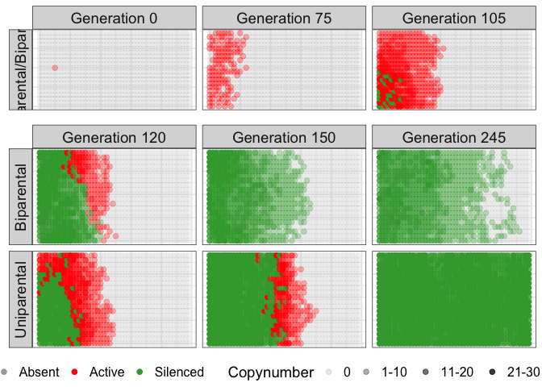
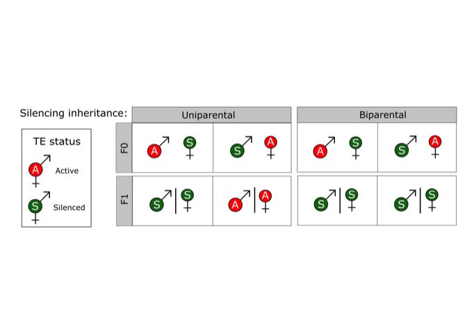
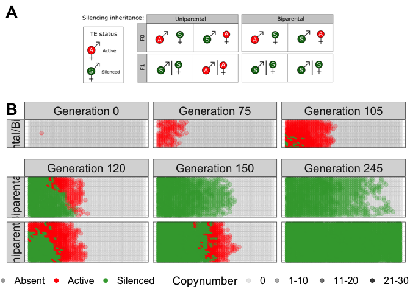

Figure 2: Simulations on the silencing spread
================

``` r
suppressPackageStartupMessages(library(tidyverse))
suppressPackageStartupMessages(library(knitr))
suppressPackageStartupMessages(library(kableExtra))
suppressPackageStartupMessages(library(ggpubr))
suppressPackageStartupMessages(library(svglite))
suppressPackageStartupMessages(library(png))
suppressPackageStartupMessages(library(magick))
suppressPackageStartupMessages(library(grid))
theme_set(theme_bw())
```

Invasion simulation plots

``` r
uni <- read_tsv("/Volumes/Storage/ara-droso/metadata/dros_comp_inds.txt") %>% select(-1) %>% mutate(mode="uniparental")
```

    ## Rows: 51000 Columns: 6
    ## ── Column specification ────────────────────────────────────────────────────────
    ## Delimiter: "\t"
    ## dbl (5): #rep, gen, Y, X, TEs
    ## lgl (1): silenced
    ## 
    ## ℹ Use `spec()` to retrieve the full column specification for this data.
    ## ℹ Specify the column types or set `show_col_types = FALSE` to quiet this message.

``` r
bi <- read_tsv("/Volumes/Storage/ara-droso/metadata/ara_comp_inds.txt") %>% select(-1) %>% mutate(mode="biparental")
```

    ## Rows: 51000 Columns: 6
    ## ── Column specification ────────────────────────────────────────────────────────
    ## Delimiter: "\t"
    ## dbl (5): #rep, gen, Y, X, TEs
    ## lgl (1): silenced
    ## 
    ## ℹ Use `spec()` to retrieve the full column specification for this data.
    ## ℹ Specify the column types or set `show_col_types = FALSE` to quiet this message.

``` r
gens <- seq(0, 250, 5)

bi_filter <- bi %>% filter(gen %in% c(0, 75, 105, 120, 150, 245))
uni_filter <- uni %>% filter(gen %in% c(0, 75, 105, 120, 150, 245))

data1 <- rbind(bi_filter,uni_filter) %>% filter(gen %in% c(0, 75, 105) & mode=="uniparental") %>% mutate(mode=ifelse(mode == "uniparental", "Uniparental/Biparental", "Biparental"), gen = paste0("Generation ", gen), gen = factor(gen, levels = c("Generation 0", "Generation 75", "Generation 105")), silenced = ifelse(silenced == TRUE, "Silenced", "Active"), silenced = ifelse(TEs==0, "Absent", silenced))
data2 <- rbind(bi_filter,uni_filter) %>% filter(gen %in% c(120, 150, 245)) %>% mutate(mode=ifelse(mode ==  "uniparental", "Uniparental", "Biparental"), gen = paste0("Generation ", gen), silenced = ifelse(silenced == TRUE, "Silenced", "Active"), silenced = ifelse(TEs==0, "Absent", silenced))

# Create a new binned variable in data1 and data2
data1$TEs_binned <- cut(data1$TEs, 
                         breaks = c(0, 0.9, 10, 20, 30, Inf),  # Define bin edges
                         labels = c("0", "1-10", "11-20", "21-30", ">30"), 
                         include.lowest = TRUE)

data2$TEs_binned <- cut(data2$TEs, 
                         breaks = c(0, 0.9, 10, 20, 30, Inf),  # Define bin edges
                         labels = c("0", "1-10", "11-20", "21-30", ">30"),  
                         include.lowest = TRUE)

# Define custom colors for each bin
bin_colors <- c("darkgrey", "red", "#3da53b")

# Modify plots to use the new binned variable
B1 <- ggplot(data1, aes(x = X, y = Y)) +
  geom_point(aes(alpha = TEs_binned, color = silenced), size = 2) +
  scale_color_manual(values = bin_colors) +  # Use discrete bins
  facet_grid(cols = vars(gen), rows = vars(mode), switch = "y") +
  theme(axis.text = element_blank(),
        axis.ticks = element_blank(),
        axis.title = element_blank(),
        strip.text.y = element_text(size = 14),
        strip.text.x = element_text(size = 14),
        legend.title = element_text(size = 14),  # Legend title size
        legend.text = element_text(size = 12)) +
  labs(color = "Status", alpha = "Copynumber")

B2 <- ggplot(data2, aes(x = X, y = Y)) +
  geom_point(aes(alpha = TEs_binned, color = silenced), size = 2) +
  scale_color_manual(values = bin_colors) +  # Use discrete bins
  facet_grid(rows = vars(mode), cols = vars(gen), switch = "y") +
  theme(axis.text = element_blank(),
        axis.ticks = element_blank(),
        axis.title = element_blank(),
        strip.text.y = element_text(size = 14),
        strip.text.x = element_text(size = 14),
        legend.title = element_text(size = 14),  # Legend title size
        legend.text = element_text(size = 12)) +
  labs(color = "Status", alpha = "Copynumber")

(B <- ggarrange(
  B1, B2, 
  ncol = 1, nrow = 2,        # Arrange one below the other
  common.legend = TRUE,      # Use a shared legend
  legend = "bottom",          # Position the legend to the right
  align = "v",               # Align panels vertically
  heights = c(0.5, 1)        # Adjust height proportions if needed
))
```

    ## Warning: Using alpha for a discrete variable is not advised.
    ## Using alpha for a discrete variable is not advised.
    ## Using alpha for a discrete variable is not advised.

<!-- -->

``` r
#ggsave("/Volumes/Storage/ara-droso/figures/2/B.png", final_plot, width = 17, height = 10)
```

``` r
img <- readPNG("/Volumes/Storage/ara-droso/figures/2/silencing-spread-schematic.png")
img_grob <- rasterGrob(img, interpolate = TRUE)
(A <- as_ggplot(img_grob))
```

<!-- -->

``` r
(FIG2 <- ggarrange(
  A, B, 
  ncol = 1, nrow = 2,        # Arrange one below the other
  common.legend = FALSE,      # Use a shared legend
  legend = "top",          # Position the legend to the right
  align = "v",               # Align panels vertically
  heights = c(0.5, 1),        # Adjust height proportions if needed
  labels = c("A", "B"),
  font.label = list(size = 20)
))
```

<!-- -->

``` r
ggsave("/Volumes/Storage/ara-droso/figures/2/FIG2.png", FIG2, width = 17, height = 12)
```
